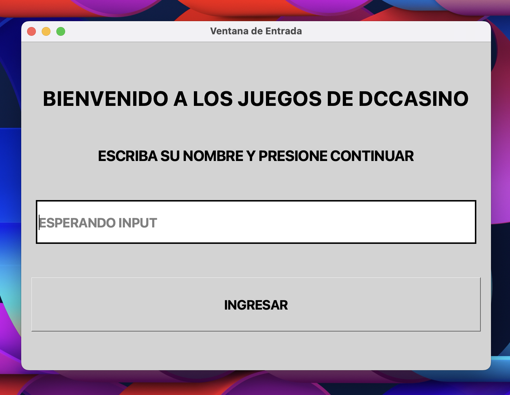
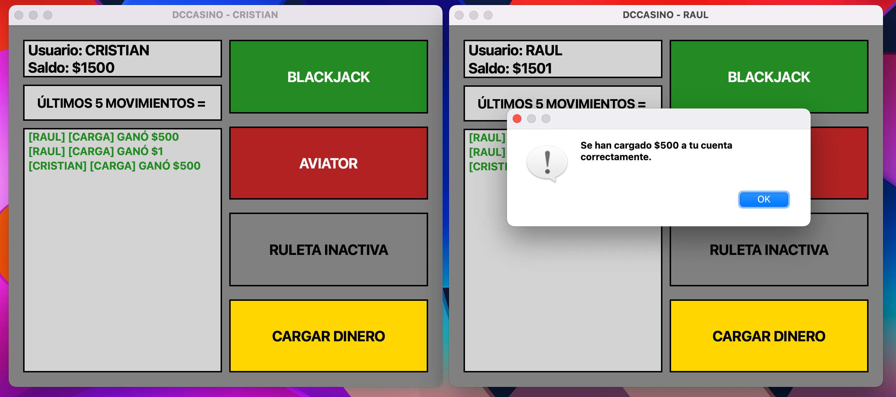
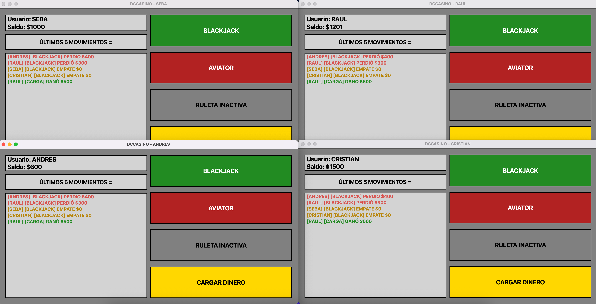
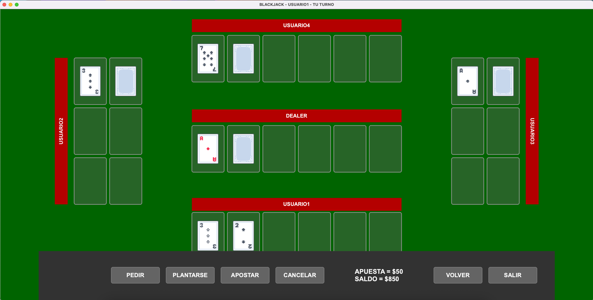
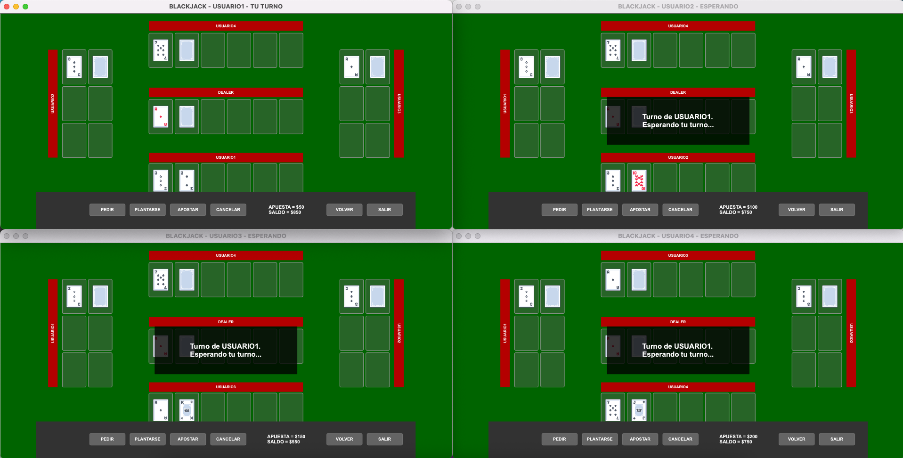
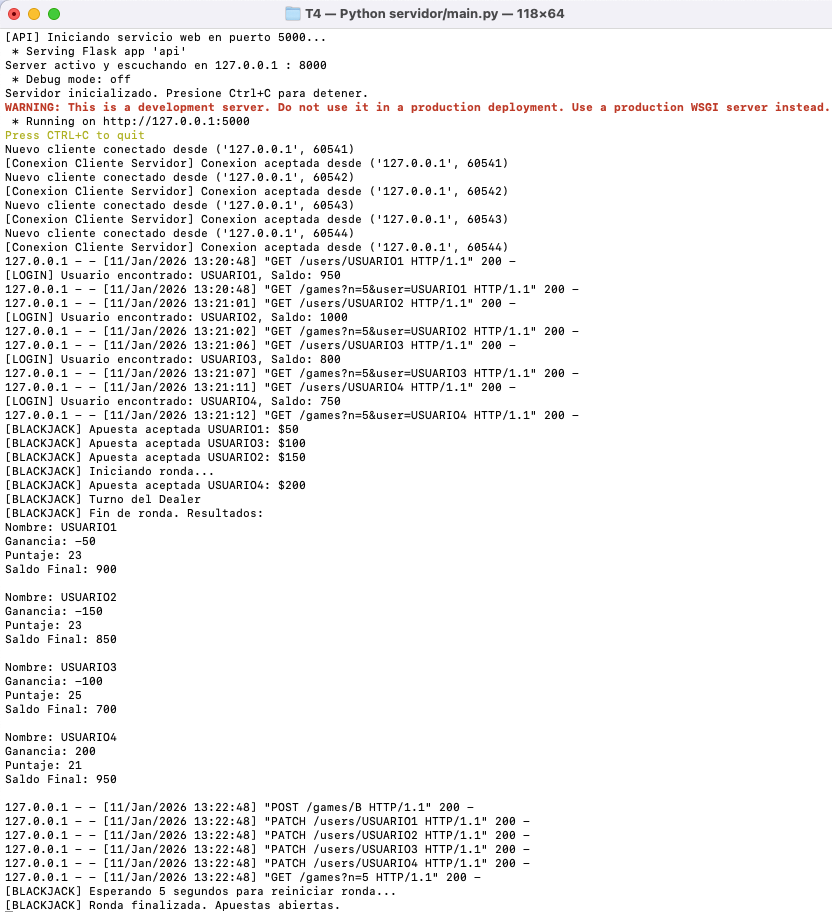
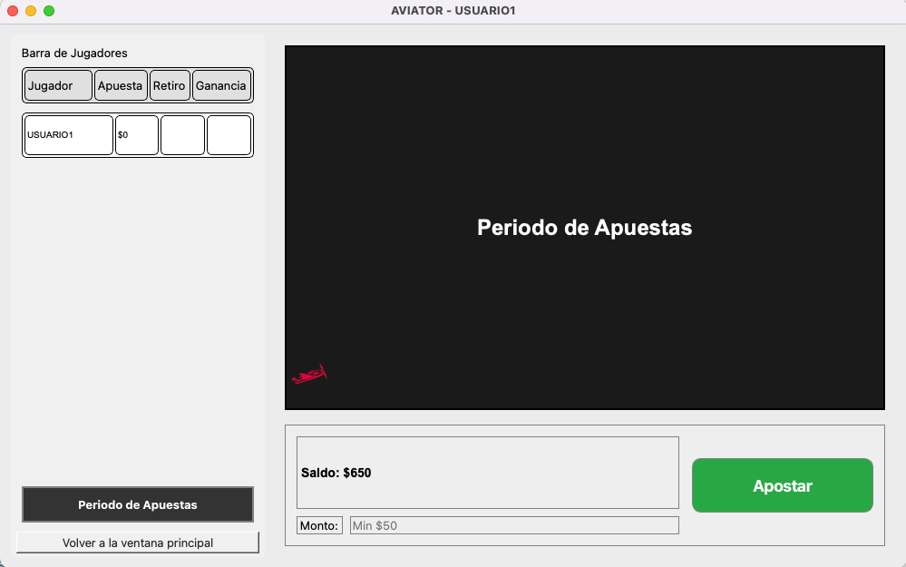
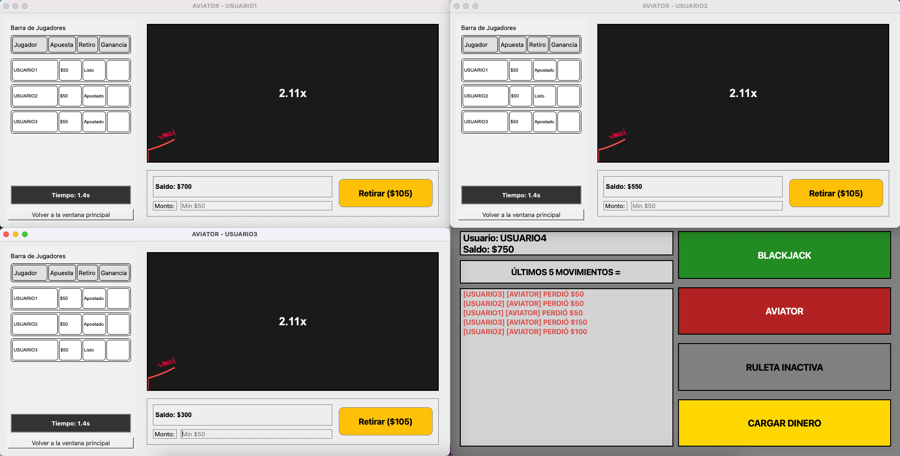
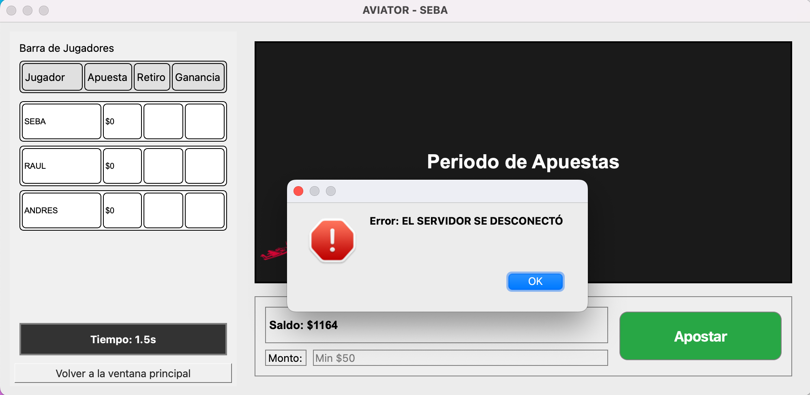

# Networked Multiplayer Casino Platform: Blackjack & Aviator

Locally hosted multiplayer gaming platform with two games, a gambling system and persistent user data.

Python | PyQt5 (GUI) | Flask REST API | TCP Sockets

## YouTube Links:
* Blackjack Demo: https://youtu.be/si28rJtOxz4
* Aviator Demo: https://youtu.be/2rIoRfPICTM 

## Quick Start

* Install requirements (see **Required Libraries and Installation Guides**).
* Set your working directory to ```T4/```.

* Start the server:
```
python3 servidor/main.py
```

* Start N players on different terminal tabs:

```
python3 cliente/main.py
```
## Key Features

* Real-time multiplayer synchronized gameplay.
* Client-Server networking through TCP sockets and a custom message protocol.
* Persistent user data: username, balance, net profits, money deposits.
* Flask-based REST API to manage users and game information.
* Interactive desktop interfaces developed with PyQt5.
* Robust error handling and edge-case coverage.


## Screenshots:
### Login Window

### Main Window: Real-Time Update of Deposits and Profits Across Players



### Blackjack Round: Client-Side



### Blackjack Round: Server-Side

### Aviator Round: Client-Side



### Graceful Server Disconnection


## Execution and Files Structure

The program runs in the terminal from the T4 folder and through the ```servidor/main.py``` and ```cliente/main.py``` commands. A single active server can handle any number of connected players, but only one active instance of each game at a time. Blackjack will start with exactly 4 players connected. Aviator will start after 3 bets are placed, by default (more details on its section). The program follows PEP8 style conventions. 

    |-T4/
    |   |
    |   |-cliente/
    |   |   |
    |   |   |-Assets/
    |   |   |   |
    |   |   |   |-Aviator/
    |   |   |   |   | ...png
    |   |   |   |-Blackjack/
    |   |   |   |   | ...png
    |   |   |   |-Ruleta/
    |   |   |   |   | ...png
    |   |   |   |
    |   |   |-backend/
    |   |   |   |
    |   |   |   |-conexion.json
    |   |   |   |-conexion.py
    |   |   |   |-logica_cliente.py
    |   |   |   |-protocolo.py
    |   |   |   |
    |   |   |-frontend/
    |   |   |   |
    |   |   |   |-auxiliar_blackjack.py
    |   |   |   |-auxiliar_aviator.py
    |   |   |   |-v_aviator.py
    |   |   |   |-v_blackjack.py
    |   |   |   |-ventanas_e_p.py
    |   |   |   |
    |   |   |-main.py
    |   |   |-parametros.py
    |   |   |
    |   |-servidor/
    |   |   |
    |   |   |-database/
    |   |   |   |
    |   |   |   |-auxiliar_database.py
    |   |   |   | * Here the .csv files are created and updated 
    |   |   |   |
    |   |   |-juegos/
    |   |   |   |
    |   |   |   |-__init__.py
    |   |   |   |-logica_aviator.py
    |   |   |   |-logica_blackjack.py
    |   |   |   |
    |   |   |-conexion.json
    |   |   |-api.py
    |   |   |-logica_servidor.py
    |   |   |-procesador.py
    |   |   |-main.py
    |   |   |-parametros.py
    |   |   |-protocolo.py
    |   |   |
    |   |-README.md

## Brief Description of the Files

### Client-Side

* ```main.py```: Manages the login, main and game windows, per client, and connects the signals between instances.
* ```parametros.py```: Variables used by all clients.

#### Backend

* ```conexion.json```: Host and port information.
* ```conexion.py```: Handles the server connection and communication from the Client-Side.
* ```logica_cliente.py```: Receives and processes server instructions. Handles PyQt5 signals to the frontend.
* ```protocolo.py```: Serialization and message encoding.

#### Frontend

* ```ventanas_e_p.py```: Login and Main Windows.
* ```v_blackjack.py``` & ```v_aviator.py```: Classes that handle in-game actions and events from the frontend.
* ```auxiliar_blackjack.py``` & ```auxiliar_aviator.py```: Auxiliary classes with helper methods for the main games GUI files.

### Server-Side

* ```api.py```: Public and private endpoints.
* ```main.py```: Runs server instance.
* ```conexion.json```: Host and port information
* ```logica_servidor.py```: Server class handles client instances and main game events.
* ```parametros.py```: Variables used by all clients, verified by the server. Keeps Auth Token and paths.
* ```procesador.py```: Handles Client-Side requests sent by logica_servidor.py.
* ```protocolo.py```: Serialization and message encoding.

#### Database

* ```auxiliar_database.py```: Helper database functions for the API.

#### Games

* ```logica_aviator.py``` & ```logica_blackjack.py```: Logic of the games and states tracking.


## Menu Windows

### Login Window

* Allows for username input and verification. Loads existing user or creates a new one.

### Main Window

* Shows the username, money balance of the user and the last five global net profits on the server. It also contains the buttons for Blackjack, Aviator and a money deposit.
* The limits of the money deposit are hard-coded and upper-bounded, as well as the maximum user balance.

## Games

### Blackjack

* The specifications file in the repository goes in depth about the rules of the game, which are simplified compared to real-life Blackjack. These rules will help clarify the gameplay screenshots and live demo. They also explain the betting rules. 
* The deck is infinite and the cards have the same dealing probability. Because of this, it may happen that a player deals repeated low-value cards and exceeds the available GUI slots. If it happens, the logic plays out properly, and the player's turn, as well as the round, are well executed. As this event is an extremely rare edge case, it was decided to prioritize layout design over adding slots that will most likely not be used.
* The table waits for exactly 4 players to start the betting phase. After the bets are placed, the game will go on as usual, no time limits. A client disconnection will not stop the round for the rest of the players. The money is lost for the disconnected user.

### Aviator

* The rules and phases of the game are in the specifications file. There isn't a limit on the amount of players that can get into the game, however, they are in a competing state to each other as the first 3 players that place a bet will play in the round, while the rest of the players will return to the main window. 
* As opposed to the Blackjack interface, Aviator can handle any number of connected players in the game because each client's window is consistent across rounds, apart from the players bar which has scroll functionality on a need-to-use basis. The default limit of 3 bets is hard-coded and can be changed in ```T4/servidor/juegos/logica_aviator.py```, line 96.
* The global round bets and results will be available for any player to see at the left side of their window in the players bar. This tracking is reset after the round ends, but the net profits and deposits are persistent as they are saved in the .csv files and shown in everyone's main window. 
* The flight pattern and exponential multiplier are calculated before the round begins, so the time the round will last is unknown but pre-determined beforehand. 


## Networking

* TCP/IP sockets implemented for Client-Server communication. A client disconnection doesn't interfere with the rest of the players or their gameplay. A server disconnection closes every client, and the GUI handles it gracefully, showing an error message window.
* Serialization and encoding are implemented for communication between parties. More details about the protocol in the specifications file. 
* A Flask-based REST API is integrated, allowing server requests to public and private endpoints. The authentication token is handled by the server, the client-side has limited access to the host and port information. 
* The server calculates and sends updates to the client in case of new profits or money deposits. It also sends requests to the API for database updates.

### Required Libraries and Installation Guides

* PyQt5 (https://pypi.org/project/PyQt5/)
* requests (https://pypi.org/project/requests/) 
* Flask (https://flask.palletsprojects.com/en/stable/installation/)

## A Note on the Context of the Project

As this was the final project of the course Advanced Programming (PUC, Chile), the file structure, naming conventions, as well as some of the design and coding choices, were made because of specifications constraints, and also thinking about the effortless correction of the assignment. Therefore, most variables, functions, classes, attributes and so on, have an Spanish name. The original README and the specifications file are also written in Spanish. For the sake of transparency, and in case something's not clear from this document, the original README file is uploaded and located at ```T4/README.md```, but beware of the language barrier.

